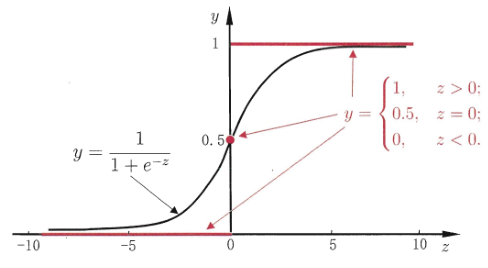

在 CTR 预估领域，最基本的模型就是 Logistic Regression

本文作者深入理解LR，并总结于下。

[TOC]

## LR 的起源

考虑二分类任务，其输出 $y\in\{0,1\}$ ，而线性回归模型产生的预测值 $z=w^Tx+b$ 是实数

但我们需要把 $z$ 转换为 $0$ 到 $1$ 上的值，即条件概率 $p(y=1|x)$ 

最理想的是“单位阶跃函数”（unit-step function）
$$
y=\left\{
\begin{aligned}
0 & & z<0 \\
0.5 & & z=0 \\
1 & & z>0
\end{aligned}
\right.
$$
$0.5$ 是阈值，$z>0$ 就是正例，$z<0$ 就是负例

如图所示，红色那条线就是单位阶跃函数

但是，单位阶跃函数不连续

由广义线性模型 $y=g^{-1}(w^Tx+b)$ ，即 $g(y)=w^Tx+b$

可知，$g(·)$ 是必须可微的，所以不连续的阶跃函数不能作为 $g(·)$ 

所以我们需要找到一个在一定程度上能近似单位阶跃函数的“替代函数”，并要求是单调可微的

符合要求的正是 logistic function：
$$
y=\frac{1}{1+e^{-z}}
$$
上图黑色的曲线就是 logistic function，对数几率函数

对数几率函数是"Sigmoid函数"的一种代表，可以把 $z$ 值转化为一个接近 $0$ 或 $1$ 的 $y$ 值，并且其输出值在 $z=0$ 附近变化很陡

把 logistic 函数代入 $g^{-1}(·)$，得到
$$
y=\frac{1}{1+e^{-(w^Tx+b)}}
$$
即
$$
ln\frac{y}{1-y}=w^Tx+b
$$

把 $y$ 视为正例的概率，$1-y$ 视为负例的概率，两者的比值 $\frac{y}{1-y}$ 成为 odds，表示 $x$ 作为正例的相对可能性

对 odds 取对数 $ln\frac{y}{1-y}=w^Tx+b$ ，得到 log odds，也叫 logit

由此可以看出，实际上是用线性回归模型的预测结果去逼近真实 $y$ 的 log odds，因此模型就成为 logistic regression

虽然叫回归，但是却是种分类方法

优点有：

- 直接对分类可能性建模，无需事先假设数据分布，避免了假设分布不准确带来的问题
- 它不是仅仅预测出“类别”，而是直接得到近似概率的预测，对需要利用概率辅助决策时很有帮助
- logistic function 是任意阶可导的凸函数，有很好的数学性质，现有许多数值优化算法都可直接求最优解

## 如何求参数 w 和 b 的值？

若把 $y$ 视为类的后验概率估计 $P(y=1|x)$ ，则上面式子可重写为
$$
ln\frac{p(y=1|x)}{p(y=0|x)}=w^Tx+b
$$
显然有
$$
p(y=1|x)=\frac{e^{w^Tx+b}}{1+e^{w^Tx+b}}
$$

$$
p(y=0|x)=\frac{1}{1+e^{w^Tx+b}}
$$

通过极大似然估计法MLE估计 $w$ 和 $b$

给定数据集 $\{(x_i,y_i)\}_{i=1}^m$，logistic regression 模型最大化 “对数似然” log-likelihood为：
$$
l(w,b)=\sum_{i=1}^mlnp(y_i|x_i;w,b)
$$
即令每个样本属于其真实标记的概率越大越好

为方便记录，令 $\beta=(w;b)$，$\hat x=(x;1)$ ，则 $w^Tx+b$ 简写为 $\beta\hat x$

再令 $p_1(\hat x;\beta)=p(y=1|\hat x;\beta)$，$p_0(\hat x;\beta)=p(y=0|\hat x;\beta)=1-p_1(\hat x;\beta)$

则似然项重写为：
$$
p(y_i|x_i;w,b)=y_ip_1(\hat x;\beta)+(1-y_i)p_0(\hat x;\beta)
$$
代回 $l(w.b)$ 后，最大化即最小化下式：
$$
l(\beta)=\sum_{i=1}^m(-y_i\beta^T\hat x_i+ln(1+e^{\beta^T\hat x_i}))
$$
$l(\beta)$ 是关于 $\beta$ 的高阶可导连续凸函数，根据凸优化理论，经典的数值优化算法如梯度下降法等都能求出最优解
$$
\beta^*=\begin{equation}
	\mathop{\arg\min}_{\beta} \ l(\beta)
\end{equation}
$$

